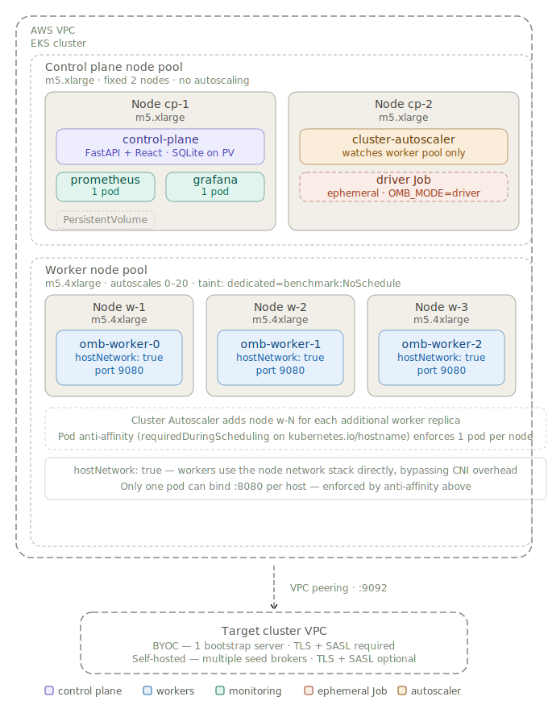

# OMB on Kubernetes

A cloud-native benchmarking platform for Redpanda and Kafka-compatible clusters
using the [OpenMessaging Benchmark](https://github.com/redpanda-data/openmessaging-benchmark)
framework. Runs OMB workers as scalable Kubernetes pods, orchestrated through a
control-plane UI. Replaces the previous Terraform + Ansible approach.

The target cluster (Redpanda or Kafka) is always external — this tool benchmarks
existing clusters and never provisions them.

## Overview



## Prerequisites

- Terraform >= 1.5
- kubectl >= 1.27
- Helm >= 3.12
- AWS CLI / gcloud / az (depending on cloud)
- Docker (for local worker image builds only)

Cloud credentials configured for your target cloud.

## Deployment

### AWS (EKS)

```bash
cd terraform/aws
cp terraform.tfvars.example terraform.tfvars
# Edit: region, vpc_cidr, availability_zones, target_vpc_id, target_cidr
# cluster_name is optional — omit to auto-generate (e.g. omb-relaxed-lemur)
export KUBECONFIG=$(pwd)/kubeconfig
terraform init && terraform apply
$(terraform output -raw kubeconfig_command)
cd ../..

helm repo add prometheus-community https://prometheus-community.github.io/helm-charts && helm repo update
helm dependency build charts/omb
helm install omb charts/omb -n omb --create-namespace \
  -f charts/omb/values-aws.yaml \
  --set clusterAutoscaler.clusterName=$(terraform -chdir=terraform/aws output -raw cluster_name) \
  --set clusterAutoscaler.region=$(terraform -chdir=terraform/aws output -raw region) \
  --set clusterAutoscaler.roleArn=$(terraform -chdir=terraform/aws output -raw cluster_autoscaler_iam_role_arn) \
  --set "controlPlane.allowedCIDRs[0]=$(terraform -chdir=terraform/aws output -raw terraform_operator_ip)/32"

# AWS returns a hostname (not an IP); DNS propagation takes ~1 min
kubectl get svc omb-control-plane -n omb -o jsonpath='{.status.loadBalancer.ingress[0].hostname}'
```

### GCP (GKE)

```bash
cd terraform/gcp
cp terraform.tfvars.example terraform.tfvars
# Edit: project_id, region, zone, target_network, target_cidr
# cluster_name is optional — omit to auto-generate (e.g. omb-relaxed-lemur)
export KUBECONFIG=$(pwd)/kubeconfig
terraform init && terraform apply
$(terraform output -raw kubeconfig_command)
cd ../..

helm repo add prometheus-community https://prometheus-community.github.io/helm-charts && helm repo update
helm dependency build charts/omb
helm install omb charts/omb -n omb --create-namespace \
  -f charts/omb/values-gcp.yaml \
  --set "controlPlane.allowedCIDRs[0]=$(terraform -chdir=terraform/gcp output -raw terraform_operator_ip)/32"

# GCP returns an IP address
kubectl get svc omb-control-plane -n omb -o jsonpath='{.status.loadBalancer.ingress[0].ip}'
```

### Azure (AKS)

```bash
cd terraform/azure
cp terraform.tfvars.example terraform.tfvars
# Edit: resource_group_name, location, target_vnet_id
# cluster_name is optional — omit to auto-generate (e.g. omb-relaxed-lemur)
export KUBECONFIG=$(pwd)/kubeconfig
terraform init && terraform apply
$(terraform output -raw kubeconfig_command)
cd ../..

helm repo add prometheus-community https://prometheus-community.github.io/helm-charts && helm repo update
helm dependency build charts/omb
helm install omb charts/omb -n omb --create-namespace \
  -f charts/omb/values-aks.yaml \
  --set "controlPlane.allowedCIDRs[0]=$(terraform -chdir=terraform/azure output -raw terraform_operator_ip)/32"

# Azure returns an IP address
kubectl get svc omb-control-plane -n omb -o jsonpath='{.status.loadBalancer.ingress[0].ip}'
```

### Upgrading

Always supply both `-f` flags explicitly — do not use `--reuse-values`. When a
cloud values file has an explicit entry (e.g. `clusterAutoscaler.region`), it
silently overwrites reused values from the previous install.

```bash
# AWS
helm upgrade omb charts/omb -n omb \
  -f charts/omb/values-aws.yaml \
  --set clusterAutoscaler.clusterName=$(terraform -chdir=terraform/aws output -raw cluster_name) \
  --set clusterAutoscaler.region=$(terraform -chdir=terraform/aws output -raw region) \
  --set clusterAutoscaler.roleArn=$(terraform -chdir=terraform/aws output -raw cluster_autoscaler_iam_role_arn) \
  --set "controlPlane.allowedCIDRs[0]=$(terraform -chdir=terraform/aws output -raw terraform_operator_ip)/32"

# GCP
helm upgrade omb charts/omb -n omb \
  -f charts/omb/values-gcp.yaml \
  --set "controlPlane.allowedCIDRs[0]=$(terraform -chdir=terraform/gcp output -raw terraform_operator_ip)/32"

# Azure
helm upgrade omb charts/omb -n omb \
  -f charts/omb/values-aks.yaml \
  --set "controlPlane.allowedCIDRs[0]=$(terraform -chdir=terraform/azure output -raw terraform_operator_ip)/32"
```

### Connecting to a target cluster

Open **Settings → Cluster Connectivity** after deployment. Enter one or more
broker addresses, then enable TLS and SASL as required by the target cluster.
Redpanda Cloud always requires both. Click **Save**.

## Scaling Workers

Workers are a StatefulSet. Scale them non-destructively through the UI or with
Helm:

```bash
# AWS
helm upgrade omb charts/omb -n omb \
  -f charts/omb/values-aws.yaml \
  --set clusterAutoscaler.clusterName=$(terraform -chdir=terraform/aws output -raw cluster_name) \
  --set clusterAutoscaler.region=$(terraform -chdir=terraform/aws output -raw region) \
  --set clusterAutoscaler.roleArn=$(terraform -chdir=terraform/aws output -raw cluster_autoscaler_iam_role_arn) \
  --set "controlPlane.allowedCIDRs[0]=$(terraform -chdir=terraform/aws output -raw terraform_operator_ip)/32" \
  --set worker.replicas=8

# GCP
helm upgrade omb charts/omb -n omb \
  -f charts/omb/values-gcp.yaml \
  --set "controlPlane.allowedCIDRs[0]=$(terraform -chdir=terraform/gcp output -raw terraform_operator_ip)/32" \
  --set worker.replicas=8

# Azure
helm upgrade omb charts/omb -n omb \
  -f charts/omb/values-aks.yaml \
  --set "controlPlane.allowedCIDRs[0]=$(terraform -chdir=terraform/azure output -raw terraform_operator_ip)/32" \
  --set worker.replicas=8
```

Each benchmark-worker node (m5.4xlarge / n2-standard-16 / Standard_D16s_v3)
comfortably fits ~8 worker pods. The Cluster Autoscaler adds nodes automatically
when needed.

Do not change worker instance types or JVM settings to increase throughput.
The correct response to needing more throughput is more worker pods.

## Tearing Down

```bash
# Uninstall the Helm release
helm uninstall omb -n omb

# Destroy the Kubernetes cluster and VPC
cd terraform/<cloud>
terraform destroy
```

**Important:** Terraform state is local. Do not delete your local state
directory until after `terraform destroy` completes successfully.

## Documentation

| Guide | Description |
|-------|-------------|
| [Deployment: AWS (EKS)](docs/deployment-aws.md) | Step-by-step EKS provisioning and Helm install |
| [Deployment: GCP (GKE)](docs/deployment-gcp.md) | Step-by-step GKE provisioning and Helm install |
| [Deployment: Azure (AKS)](docs/deployment-azure.md) | Step-by-step AKS provisioning and Helm install |
| [Running Benchmarks](docs/running-benchmarks.md) | Configuring connectivity, workloads, single runs, sweeps |
| [Scaling Workers](docs/scaling-workers.md) | How to scale worker pods mid-engagement |
| [Architecture](docs/architecture.md) | Component diagram, worker discovery, run lifecycle |
| [Teardown](docs/teardown.md) | Safe cleanup — Helm uninstall and terraform destroy |

## Worker Image

See [worker/README.md](worker/README.md) for local build and test instructions.
